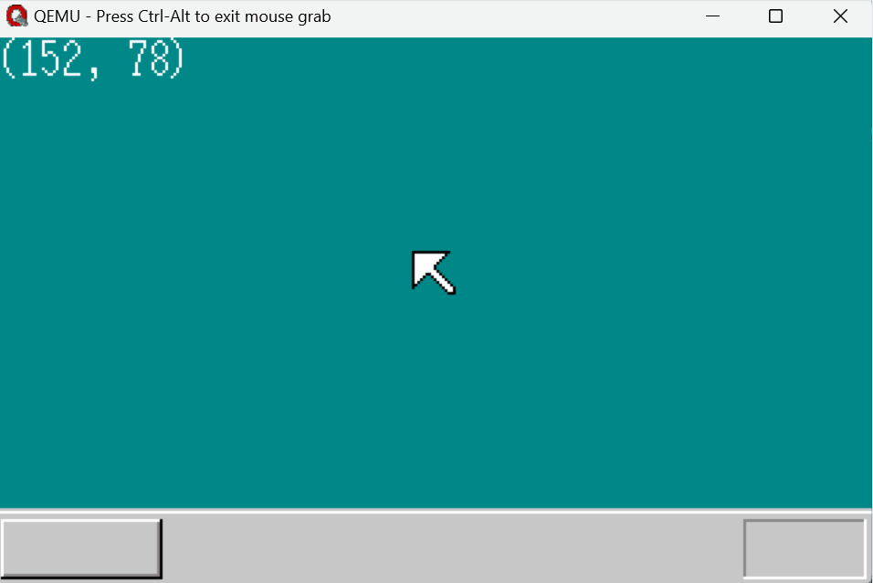

# MINOS: Custom Operating System

MINOS는 x86 환경을 위한 자체 제작 운영체제 프로젝트입니다. 부트로더, GUI 시스템, 디바이스 드라이버 및 일부 표준 C 라이브러리 구현을 포함하고 있습니다.

## 현재까지 구현한 기능
- **부트로더 (x86 환경)**: MBR(Master Boot Record) 기반 부트로더, GRUB 없이 독립적으로 부팅 가능
- **리얼모드/보호모드 커널**: A20 게이트 활성화 및 보호 모드 전환 지원
- **키보드/마우스 드라이버**: PS/2 키보드 및 마우스 이벤트 처리, 인터럽트 핸들러 작성
- **GUI 시스템**: VGA 모드를 활용한 기본 UI 렌더링, 문자열 출력 및 기본 도형 그리기
- **메모리 관리**: `malloc`, `free`에 대응하는 함수 구현
- **표준 C 라이브러리 일부 구현**: `vsprintf`, `sprintf`, `string.h`, `ctype.h` 일부 함수 지원

## 기술 스택
- **언어**: Assembly Language (x86), C
- **아키텍처**: x86 Real Mode & Protected Mode
- **빌드 시스템**: GAS, GCC, LD, GNU Make, Docker
- **에뮬레이터**: QEMU

## 상세 기술 구현
### 부트로더 (Bootloader)
- MBR을 기반으로 하는 512바이트 부트로더
- 리얼 모드 커널 로딩

### 보호모드 커널 (Protected Mode Kernel)
#### GUI 시스템
- VGA 모드를 활용한 기본 UI 렌더링
- 문자열 출력 및 기본 도형 그리기 기능 제공

#### 디바이스 드라이버
- GDT/IDT 설정 및 PIC 조작
- PS/2 키보드 및 마우스 이벤트 처리
- 인터럽트 핸들러 작성 및 처리

### 표준 C 라이브러리 일부 구현
- **ctype.h**: `isalnum`, `isalpha`, `isascii`, `isdigit`, `islower`, `isprint`, `isspace`, `isupper`, `toupper`, `tolower`
- **string.h**: `memchr`, `memrchr`, `memcmp`, `memcpy`, `memmove`, `memset`, `strchr`, `strlen`, `strspn`
- **vsprintf, sprintf**

## 빌드 및 실행 방법
```sh
git clone https://github.com/gloeophycus/minos.git
cd minos
docker build -t dev .
make
sudo apt install qemu-system-x86_64
sudo qemu-system-x86_64 -L . -m 64 -fda disk.img -M pc
```



## 기술적 도전과 해결 방법
### 보호 모드 전환 문제
- 32비트 커널을 컴파일하기 위해 `-m32` 옵션을 사용했으나 ABI 불일치 문제로 전환 실패
- **해결 방법**: 일관된 개발 환경 제공을 위해 Docker를 도입하여 문제 해결

### 마우스 드라이버 구현 문제
- 마우스는 키보드와 달리 부팅 직후 비활성화 되어있음
- **해결 방법**:
  - 키보드 컨트롤러 초기화
  - 마우스 활성화
  - PIC 초기화, 인터럽트 핸들러 작성, 마우스 데이터 해석

### 메모리 체크 에러 문제
- 컴파일러 최적화 문제로 메모리 크기 체크 실패
- **해결 방법**: volatile 키워드로 컴파일러 최적화 무시

## 향후 개발 계획
- Shell 구현
- 프로세스 관리 및 멀티태스킹 지원
- TCP/IP 네트워크 스택 개발
